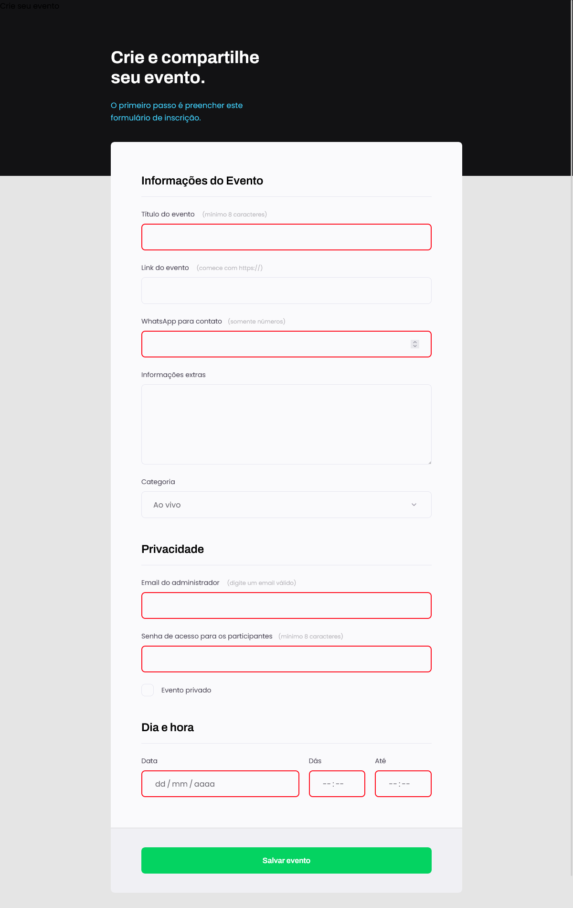

# Projeto 03 - Crie seu evento | RocketSeat 

Projeto de um formulário para cadastro de eventos, utilizando tags para títulos, parágrafos, campos de preenchimento, links e fontes externas.

## 🛠 Tecnologias 
- HTML
- CSS
- Git
- Github

## 💻 Contato 

 > kennylima@hotmail.com