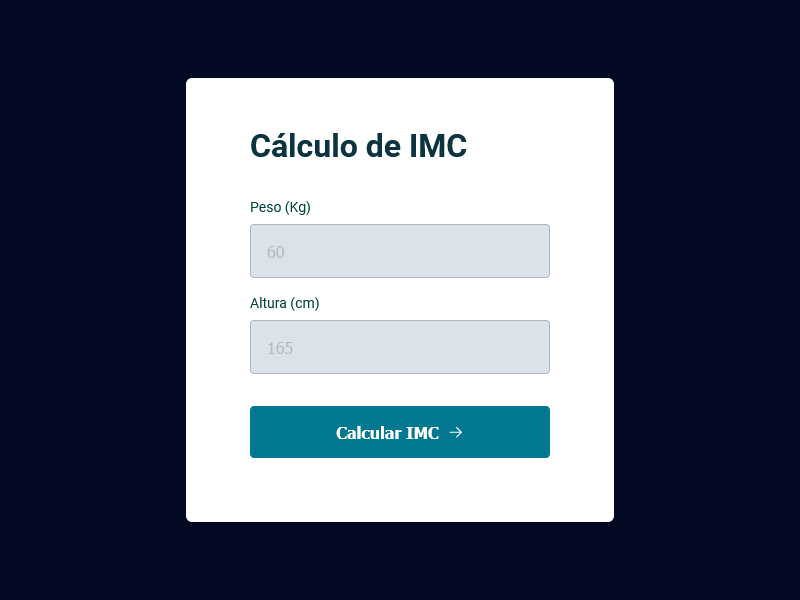

# Avançando no Javascript | Curso Explorer 2022 - RocketSeat 

Aplicações em HTML e CSS com Javascript

---

[🔗 Jogo da adivinhação](https://github.com/kennylima/Trilha_explorer_RocketSeat/tree/main/08%20-%20Avan%C3%A7ando%20no%20Javascript/01%20-%20Jogo%20da%20adivinha%C3%A7%C3%A3o) | Executado no navegador, onde o usuário tenta adivinhar o número pensado pela máquina e ao acertar, o JavaScript muda de tela automaticamente.

---

[🔗 Projeto IMC](https://github.com/kennylima/Trilha_explorer_RocketSeat/tree/main/08%20-%20Avan%C3%A7ando%20no%20Javascript/02%20-%20Projeto%20IMC) | Página executada no navegador, onde o usuário insere o peso e sua altura e o código retorna o IMC. Foi utilizado modularização no Javascript.

---

[🔗 Desafio 3]() | Descrição

## 🛠 Tecnologias 
- HTML
- CSS
- JavaScript
- Git
- Github

## 💻 Contato 

 > kennylima@hotmail.com