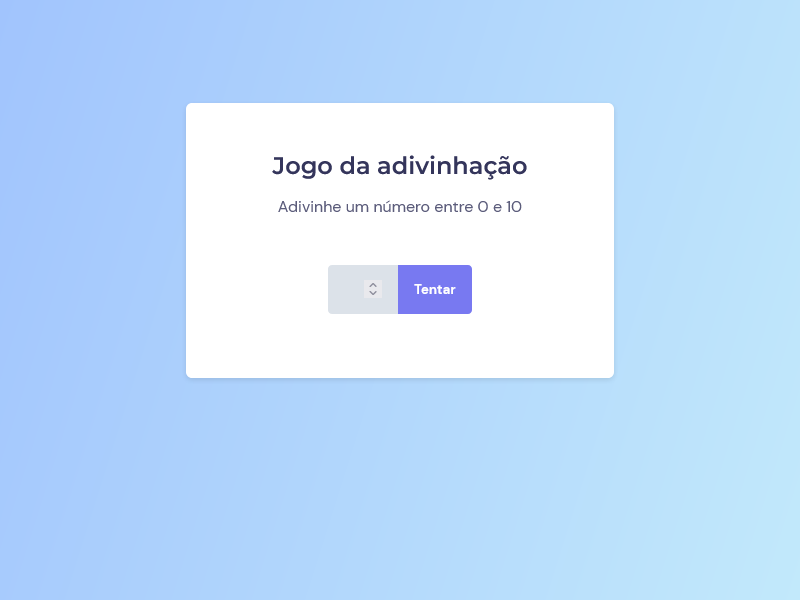

# Avançando no Javascript | Curso Explorer 2022 - RocketSeat 

Projetos de Javascript com HTML e CSS

---

[🔗 Jogo da adivinhação](https://github.com/kennylima/Trilha_explorer_RocketSeat/tree/main/08%20-%20Avan%C3%A7ando%20no%20Javascript/01%20-%20Jogo%20da%20adivinha%C3%A7%C3%A3o) | Jogo da adivinhação que roda no navegador, onde o usuário tenta adivinhar o número pensado pela máquina e ao acertar, o JavaScript muda de tela automaticamente.

---

[🔗 Desafio 2]() | Descrição

[🔗 Desafio 3]() | Descrição

## 🛠 Tecnologias 
- HTML
- CSS
- JavaScript
- Git
- Github

## 💻 Contato 

 > kennylima@hotmail.com