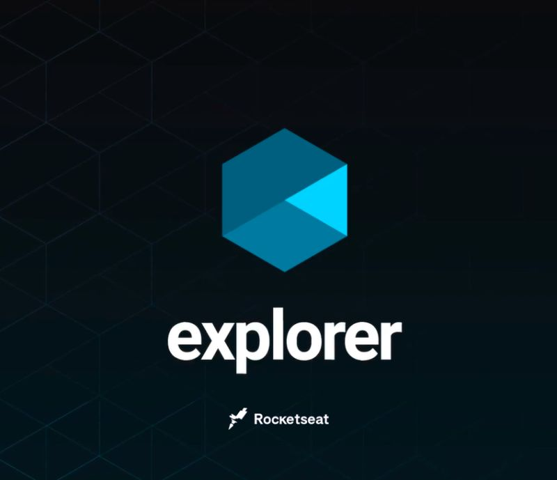

# Curso Explorer 2022 | RocketSeat 

Curso explorer FullStack da RocketSeat, utilizando NodeJs no Back-end. 

[🔗 Módulo 1 - Introdução ao JavaScript](https://kennylima.github.io/Maratona_explorer_RocketSeat/)

[🔗 Módulo 2 - Algoritmos e lógica de programação](https://kennylima.github.io/Maratona_explorer_RocketSeat/)

[🔗 Módulo 3 - Projeto 1 (Móveis customizados)](https://kennylima.github.io/Maratona_explorer_RocketSeat/)

[🔗 Módulo 4 - Projeto 2 (Treine me)](https://kennylima.github.io/Maratona_explorer_RocketSeat/)

[🔗 Módulo 5 - Projeto 3 (Crie seu evento)](https://kennylima.github.io/Maratona_explorer_RocketSeat/)

[🔗 Módulo 6 - Projeto 4 (Introdução a responsividade)](https://kennylima.github.io/Maratona_explorer_RocketSeat/)

[🔗 Módulo 7 - Projeto 5 (Componente trabalhos)](https://kennylima.github.io/Maratona_explorer_RocketSeat/)

## 🛠 Tecnologias 
- HTML
- CSS
- JavaScript
- NodeJs
- MySQL
- Git
- Github

## 💻 Contato 

 > kennylima@hotmail.com